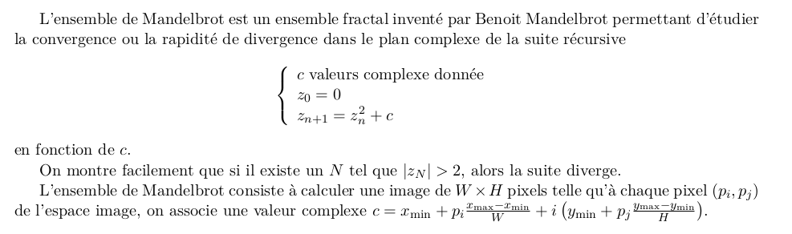
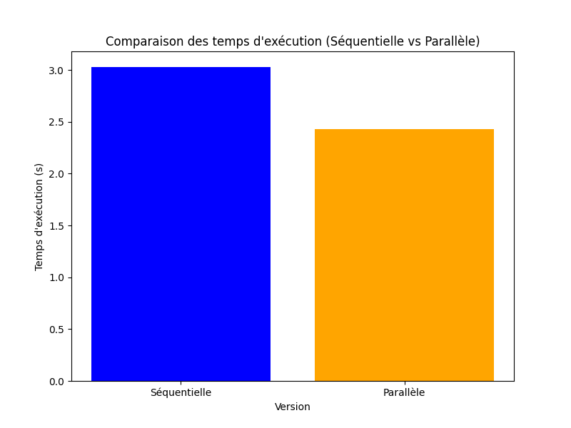
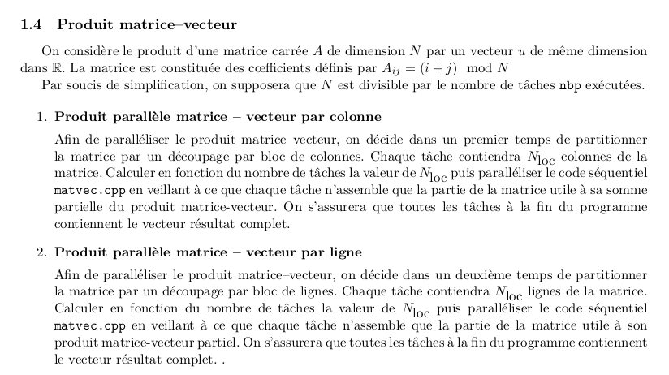

## 1 Exercices à rendre
### 1.1 Question du cours
Reprendre l’exercice sur l’interblocage donné dans le cours et décrivez deux scénarios :

```
if (rank==0)
{
    MPI_Recv(rcvbuf, count, MPI_DOUBLE, 1, 101, commGlob, &status);
    MPI_Send(sndbuf, count, MPI_DOUBLE, 1, 102, commGlob);
}
else if (rank==1)
{
    MPI_Recv(rcvbuf, count, MPI_DOUBLE, 0, 102, commGlob, &status);
    MPI_Send(sndbuf, count, MPI_DOUBLE, 0, 101, commGlob);
}
```

1. Un premier scénario où il n’y a pas d’interblocage ;
```
MPI_Request request;
MPI_Status  status;
int request_complete = 0;

// Rank 0 sends, rank 1 receives
if (rank == 0)
{
  MPI_Isend(buffer, buffer_count, MPI_INT, 1, 0, MPI_COMM_WORLD, &request);

  // Do some work while waiting for process 1 to be ready
  while (has_work)
  {
    do_work();

    // Test if the request is not already fulfilled
    if (!request_complete)
    {
       MPI_Test(&request, &request_complete, &status);
    }
  }

  // No more work, wait for the request to be complete if it's not the case
  if (!request_complete)
  {
    MPI_Wait(&request, &status);
  }
}
else
{
  MPI_Irecv(buffer, buffer_count, MPI_INT, 0, 0, MPI_COMM_WORLD, &request);

  // Wait for the message to come
  MPI_Wait(&request, &status);
}
```

2. Un deuxième scénario où il y a interblocage.
```
if (rank == 0)
{
    MPI_Recv(rcvbuf, count, MPI_DOUBLE, 1, 101, commGlob, &status);
    MPI_Send(sndbuf, count, MPI_DOUBLE, 1, 102, commGlob);
}
else if (rank == 1)
{
    MPI_Recv(rcvbuf, count, MPI_DOUBLE, 0, 102, commGlob, &status);
    MPI_Send(sndbuf, count, MPI_DOUBLE, 0, 101, commGlob);
}
```

Quelle est à votre avis la probabilité d’avoir un interblocage ?

À mon avis, la probabilité d'interblocage dépend de la façon dont les messages sont échangés entre les processus et de la taille du système. Dans cet exemple, si les messages sont de taille suffisamment petite et que le réseau MPI est rapide, il est possible que l'interblocage ne se produise pas souvent. Cependant, cela peut varier en fonction de nombreux autres facteurs, y compris la charge du système et les caractéristiques de la communication réseau.

Pour éviter l'interblocage, il est important de concevoir vos algorithmes de communication de manière à minimiser les attentes mutuelles et à utiliser des techniques telles que le partage des ressources et la communication non bloquante lorsque cela est possible.

### 1.2 Question du cours n°2
Alice a parallélisé en partie un code sur machine à mémoire distribuée. Pour un jeu de données spécifiques, elle remarque que la partie qu’elle exécute en parallèle représente en temps de traitement 90% du
temps d’exécution du programme en séquentiel. 
En utilisant la loi d’Amdhal, pouvez-vous prédire l’accélération maximale que pourra obtenir Alice  avec son code (en considérant n ≫ 1) ? 
À votre avis, pour ce jeu de donné spécifique, quel nombre de nœuds de calcul semble-t-il raisonnable  de prendre pour ne pas trop gaspiller de ressources CPU ? 
En effectuant son cacul sur son calculateur, Alice s’aperçoit qu’elle obtient une accélération maximale de quatre en augmentant le nombre de nœuds de calcul pour son jeu spécifique de données. 
En doublant la quantité de donnée à traiter, et en supposant la complexité de l’algorithme parallèle linéaire, quelle accélération maximale peut espérer Alice en utilisant la loi de Gustafson ?

#### Reponse
1. Prédire l’accélération maximale ? (n >> 1)
Suivant la loi d’Amdhal :
```
S = n / (1 + (n - 1) * f) = | si n -> infinity | = 1 / f = 1 / (1 - 0.9) = 1 / 0.1 = 10
```
2. Quel nombre de nœuds est raisonnable pour ne pas trop gaspiller CPU ?
```
S = n / (1 + (n - 1) * f) => n = s * (1 - f) / (1 - sf)
```
J'ai essayée d'utiliser les valeurs differentes de n pour observer l'acélération. 
n = 10000 => s = 9.99
n = 1000 => s = 9
n = 100 => s = 9.9
n = 3 => s = 2.5

Ensuite, j'ai comptée quel sera le valeur du n pour que s = 9 : _n >= 81_

3. Acceleration est 4 en max. la loi de Gustafson -> quel est accélération maximal ?
En doublant la quantité des données => f = 0.1 * 2 = 0.2.
Selon loi de Gustafson :
```
S = f + (1 - f) n = 0.2 + 0.8n
```

On connait qu'Alice a obtenué S = 4, donc :
```
0.2 + 0.8n = 4 => n = 0.8 / 3.8 = 4.75
```
Alors, on a besoin de 5 noeds.

### 1.3 Ensemble de mandelbrot
 

1. À partir du code séquentiel mandelbrot.cpp, faire une partition équitable par ligne de l’image à
calculer pour distribuer le calcul sur les nbp tâches exécutées par l’utilisateur puis rassembler l’image
sur le processus zéro pour la sauvegarder. Calculer le temps d’exécution pour différents nombre de
tâches et calculer le speedup. Comment interpréter les résultats obtenus ?
#### Reponse
Le temps de calcul de l'ensemble de Mandelbrot est d'environ 2,43 secondes, et le speedup obtenu est d'environ 1,25. Cela signifie que la version parallélisée du calcul est environ 1,25 fois plus rapide que la version séquentielle. Cette amélioration de performance est significative, mais il est possible qu'il y ait encore des possibilités d'optimisation pour atteindre des gains de vitesse plus importants.
(fichier _mandelbrot.py_)


2. Mettre en œuvre une stratégie maître–esclave pour distribuer les différentes lignes de l’image à
calculer. Calculer le speedup avec cette nouvelle approche. Qu’en conclure ?
#### Reponse
```
Temps du calcul de l'ensemble de Mandelbrot : 2.4104251861572266
Speedup: 1.2563955135362257
```
Ces résultats indiquent que l'utilisation d'une stratégie maître-esclave pour distribuer les différentes lignes de l'image à calculer a permis d'obtenir un speedup d'environ 1.256 par rapport à l'exécution séquentielle. Cela signifie que l'exécution parallèle avec la stratégie maître-esclave a été environ 1.256 fois plus rapide que l'exécution séquentielle. Cette amélioration de la performance montre l'efficacité de la parallélisation du calcul de l'ensemble de Mandelbrot avec MPI dans ce contexte.

Pour exécuter le script, utilisez la commande suivante :
```
mpirun -n [nombre_de_processus] python3 mpi_mandelbrot_master_slave.py [largeur] [hauteur] [nombre_de_fragments]
```

- `[nombre_de_processus]`: Nombre de processus MPI à utiliser pour le calcul parallèle.
- `[largeur]`: Largeur de l'image de sortie.
- `[hauteur]`: Hauteur de l'image de sortie.
- `[nombre_de_fragments]`: Nombre de fragments d'image à répartir entre les processus MPI pour le calcul parallèle.

Par exemple :
```
mpirun -n 4 python3 mpi_mandelbrot_master_slave.py 1024 1024 8
```


### 1.4 Produit matrice–vecteur
 

#### Reponse
Pour la première approche, où nous avons parallélisé le produit matrice-vecteur par colonne, chaque tâche a été chargée de calculer la somme partielle du produit en utilisant un découpage par bloc de colonnes de la matrice. La valeur de Nloc, le nombre de colonnes dans chaque bloc, a été calculée en fonction du nombre de tâches. Le code séquentiel a été adapté pour que chaque tâche ne calcule que la partie de la matrice nécessaire à sa somme partielle du produit matrice-vecteur. À la fin du programme, nous avons vérifié que toutes les tâches contenaient le vecteur résultat complet.

Quant à la deuxième approche, où nous avons parallélisé le produit matrice-vecteur par ligne, nous avons partitionné la matrice par un découpage par bloc de lignes, chaque tâche étant chargée de calculer la somme partielle du produit en utilisant Nloc lignes de la matrice. La valeur de Nloc a été calculée en fonction du nombre de tâches. Le code séquentiel a été modifié pour que chaque tâche ne calcule que la partie de la matrice nécessaire à son produit matrice-vecteur partiel. À la fin du programme, nous nous sommes assurés que toutes les tâches contenaient le vecteur résultat complet.

Les fichiers: _matvec_lines.py_ et _matvec_colonnes.py_