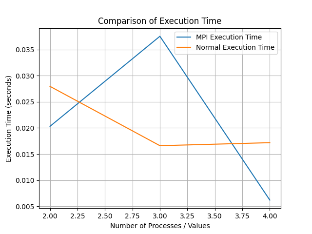

# TD n°3 - parallélisation du Bucket Sort

*Ce TD peut être réalisé au choix, en C++ ou en Python*

Implémenter l'algorithme "bucket sort" tel que décrit sur les deux dernières planches du cours n°3 :

- le process 0 génère un tableau de nombres arbitraires, OK
- il les dispatch aux autres process,
- tous les process participent au tri en parallèle,
- le tableau trié est rassemblé sur le process 0.

## Utilisation
Pour exécuter les deux fichiers (avec et sans parallélisation), générer le tableau et le graphique :
```commandline
python3 main.py
```

Or each file Ou chaque fichier séparément :
- pour bucket_sort_mpi.py
```
 mpiexec -np <number_of_processes> python3 bucket_sort_mpi.py 
```

- pour bucket_sort.py
```
python3 bucket_sort.py 
```

## Résultat
```markdown
| N processes / buckets | MPI Execution Time | Normal Execution Time |
|------------------------|--------------------|-----------------------|
|           2            |     0.0203071      |        0.027957       |
|           3            |     0.0375371      |       0.0166056       |
|           4            |    0.00619984      |       0.0171802       |
```


