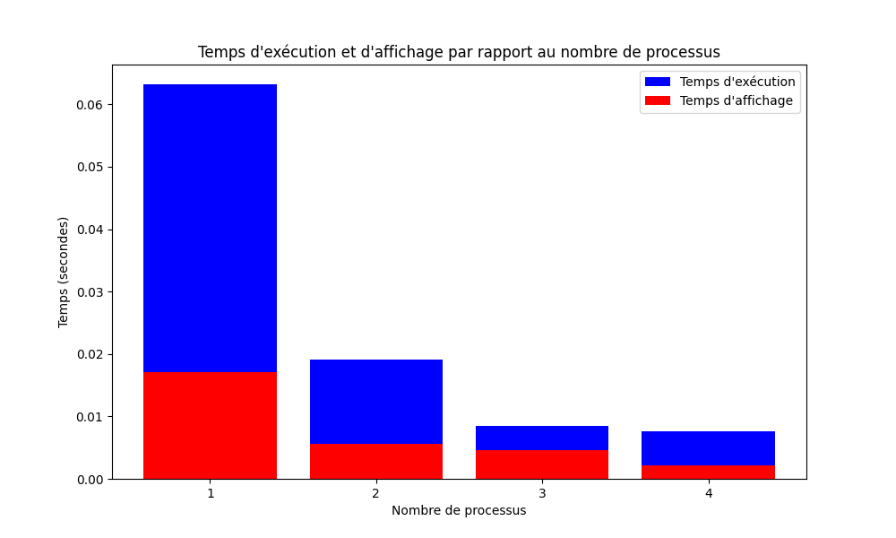

# Automate cellulaire en parallèle avec MPI

Ce TD consiste à implémenter un automate cellulaire en utilisant le modèle de programmation MPI pour le calcul en parallèle. L'automate cellulaire est basé sur le "Jeu de la vie" de John Conway.

## Exécution

```
mpiexec -n <number of processus> python main_mpi.py
```
Par example, pour exécuter avec 4 processus :
```
mpiexec -n 4 python main_mpi.py
```

## Résultats

Le programme génère des fichiers de sortie qui peuvent être analysés pour évaluer les performances. Voici un exemple de graphique représentant les temps d'exécution et d'affichage en fonction du nombre de processus :



Comme le montre le graphique, on peut observer une diminution significative des temps d'exécution et d'affichage lorsque le nombre de processus augmente. Cela montre l'efficacité du parallélisme MPI dans ce contexte.

